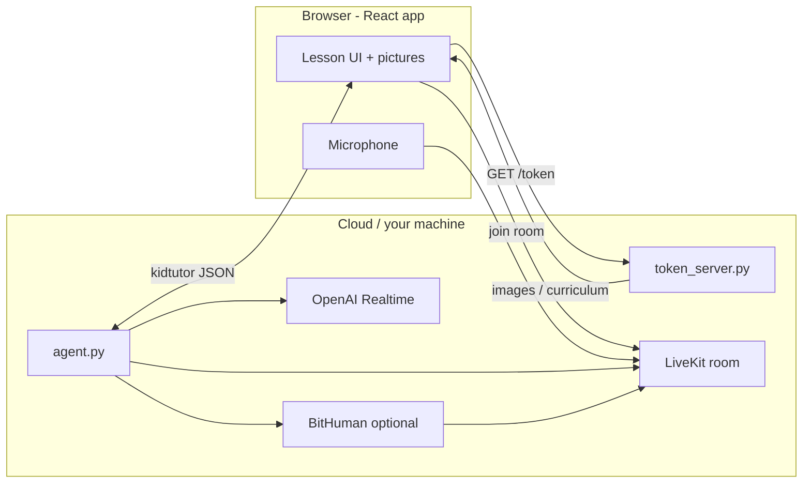

# Kid Tutor — How It Works (Simple Guide)

This document explains the **end-to-end flow** of the Essence Cloud kid tutor app in plain language. It is meant for developers, QA, and anyone onboarding to the project.

For setup commands, see [README.md](README.md).

**Visual flowchart:** open [WORKFLOW_DIAGRAM.html](WORKFLOW_DIAGRAM.html) in a browser (for managers / presentations).

---

## The big picture in one sentence

The **browser app** opens a **live voice room**, the **Python agent** loads the **lesson words and rules**, talks to the child, and keeps the **on-screen picture** aligned with the **current word** while audio (and optionally avatar video) flows through **LiveKit**.

---

## The three main pieces

| Piece | What it is | What it does |
| ----- | ---------- | ------------ |
| **React app** (`frontend/`) | What the child sees and taps | Picks mode/theme/tutor, joins the room, shows lesson pictures, plays tutor audio |
| **Token server** (`token_server.py`) | Small API | Gives the browser a safe key to join LiveKit; serves curriculum images |
| **Agent** (`agent.py`) | AI tutor in the cloud | Joins the same room, speaks with OpenAI Realtime, optional BitHuman avatar, scores speech, syncs the lesson |

All three must be running locally during development (see README).

---

## Step-by-step flow

### 1. Child picks a lesson in the app

On the home screen the user chooses:

- **Child’s name** and **tutor** (e.g. Leo / Luna)
- **Mode**: vocabulary, speaking practice, or quiz
- **Theme** (e.g. animals, food)

The app builds a **room name** that encodes those choices:

```text
kidtutor-{mode}-{topic}-{tutor}-{sessionId}
```

Example: `kidtutor-quiz-animals-leo-a1b2c3d4`

The agent reads this name when it joins so it knows **what kind of lesson** to run without extra setup.

---

### 2. Browser joins the live “classroom”

When the child taps **Start**:

1. The app calls the **token server** (`GET /token`) with the room name.
2. The server returns a **JWT** and LiveKit URL.
3. The React app connects to **LiveKit** — a real-time room where **audio** (and optionally **video**) flows between the device and the cloud agent.

Microphone permission is required so the child can speak.

---

### 3. Agent starts and loads the lesson

When a participant is in the room, the **agent worker** (`python agent.py dev`) is dispatched to that room. It:

1. **Parses the room name** → mode, topic, tutor.
2. Loads the **fixed word list** for that topic from `data/word_lists.json` (same order as the pictures).
3. Builds **instructions** from `data/prompts/` and `prompt_config.py` (personality, mode rules, pronunciation policy).
4. Starts **OpenAI Realtime** for natural voice conversation.
5. Optionally starts **BitHuman** to publish a talking avatar video track.

The agent also sends the child’s name from the app (`child_profile` on the data channel) into its instructions so it addresses the right learner.

---

### 4. What the child sees: picture + voice

The lesson UI shows:

- **Tutor** — voice and optionally avatar video
- **Big picture** — one image per vocabulary word, in list order (index 0, 1, 2, …)

The **word index** is the link between “what’s on screen” and “what the tutor is teaching.” The agent and the carousel should always agree on that index.

---

### 5. The conversation loop

This repeats for the whole session:

```text
Tutor speaks  →  Child speaks  →  Speech becomes text (STT)  →  Agent decides what to do  →  UI updates (if needed)  →  Tutor speaks again
```

**Greeting first:** The tutor introduces itself and asks a friendly opener (e.g. “What’s your name?”). It does **not** jump straight into vocabulary until the child has replied.

**After the lesson starts**, behavior depends on **mode** (see below).

---

### 6. Three lesson modes (simple view)

| Mode | Main goal | Picture / scoring |
| ---- | --------- | ----------------- |
| **Vocabulary** | Teach each word: say it, explain, example, child repeats, quick check | Pronunciation can be scored; picture can auto-advance on a good attempt (see env flags) |
| **Speaking** | Practice saying words clearly, game-like repeats | Same scoring pipeline as vocabulary |
| **Quiz** | Fun questions about **what is on the current picture** (color, sound, habitat, silly choices) | No pronunciation scoring loop; tutor should quiz the **current** image, then move picture when changing words |

Mode-specific wording lives in `prompt_config.py`. Quiz mode is instructed to keep questions tied to the **object on screen right now**.

---

### 7. Keeping the picture in sync

The agent tracks an internal **word index**. The React carousel has its own **index**. They stay aligned via:

**Agent → browser** (data topic `kidtutor`):

- `lesson_set_index` — “show picture at index N”
- `pronunciation_result` — score, band, encouragement cues
- `lesson_complete` — lesson finished; UI can wrap up

**Browser → agent**:

- `child_profile` — child’s name from the home screen
- `lesson_index` — child tapped **Next** / **Back** on the picture controls

The agent can also call tools **`go_to_next_lesson_word`** and **`sync_lesson_picture_index`** when the AI moves to another word in the list.

**Deferred advance (optional):** With `KID_TUTOR_DEFER_PICTURE_UNTIL_RESPONSE=1`, after a correct pronunciation the tutor may celebrate and ask about the **next** word while the **picture stays** on the previous one until the child speaks again (e.g. “yes” or tries the new word). This avoids the image jumping ahead too early.

---

### 8. Pronunciation scoring (vocabulary & speaking only)

For modes `vocabulary` and `speaking`, when the child’s speech looks like an attempt at the **current target word**:

1. `pronunciation_score.py` compares transcript to the expected word (edit distance / token match).
2. Result is **correct**, **almost**, or **incorrect** using thresholds from `data/prompts/pronunciation_rules.json`.
3. The agent publishes `pronunciation_result` to the UI and may refresh what the tutor says next.
4. Short replies like “yes” or “I’m ready” are **not** treated as pronunciation attempts (so warm-up chat does not skip words by mistake).

Quiz mode does **not** use this scoring loop; it is conversational Q&A guided by prompts.

---

### 9. Session end

The lesson ends when:

- The last word is done and the agent signals **`lesson_complete`**, or
- The user leaves / closes the tab (LiveKit disconnects and the agent session stops).

---

## Simple architecture diagram



---

## Key files (where to look)

| File / folder | Role |
| ------------- | ---- |
| `frontend/src/App.js` | Mode selection, routing into a lesson |
| `frontend/src/TutorRoom.js` | LiveKit room, loader, child profile publish |
| `frontend/src/LessonPicturePanel.js` | Picture carousel, listens for `lesson_set_index` |
| `token_server.py` | Tokens + curriculum API |
| `agent.py` | Room join, Realtime session, scoring, data channel, lesson tools |
| `prompt_config.py` | Builds tutor instructions per mode |
| `kid_lesson_session.py` | Word index, retries, live instruction suffix |
| `pronunciation_score.py` | Scoring and “is this just chat?” heuristics |
| `data/word_lists.json` | Words per theme |
| `data/prompts/*.json` | Personality, templates, pronunciation rules |

---

## Room name cheat sheet

```text
kidtutor-{vocabulary|speaking|quiz}-{topic_slug}-{tutor_slug}-{randomId}
```

- **mode** — how the tutor behaves  
- **topic_slug** — which word list / pictures (e.g. `animals`)  
- **tutor_slug** — which character voice/persona (e.g. `leo`)  
- **randomId** — unique session id so each visit gets a fresh room  

The React app constructs this automatically; manual testing must use the same pattern or the token server will reject the room name.

---

## Common env flags (behavior, not setup)

Documented in detail in `.env.example`. Short meanings:

| Variable | Effect |
| -------- | ------ |
| `KID_TUTOR_USE_AVATAR=0` | Voice-only; no BitHuman video |
| `KID_TUTOR_AUTO_ADVANCE_ON_CORRECT` | Move to next word after a strong pronunciation |
| `KID_TUTOR_DEFER_PICTURE_UNTIL_RESPONSE` | Wait for child speech before updating picture after correct |
| `OPENAI_REALTIME_MODEL` | Which OpenAI Realtime model the agent uses |

---

## Troubleshooting (flow-related)

| Symptom | Likely cause |
| ------- | ------------- |
| “Tutor hasn’t joined yet” | `python agent.py dev` not running or wrong `LIVEKIT_*` credentials |
| Picture and tutor talk about different words | Index out of sync — check `lesson_set_index` / `lesson_index` messages and agent logs |
| No tutor audio | Check OpenAI key/model; in voice-only mode ensure avatar is off so audio publishes to the room |
| Quiz feels generic | Agent needs restart after prompt changes; quiz instructions are in `prompt_config.py` |

More setup issues: [README.md — Troubleshooting](README.md#troubleshooting).

---

*Last updated for the kid tutor stack: React + token_server + agent.py + LiveKit + OpenAI Realtime (+ optional BitHuman).*
